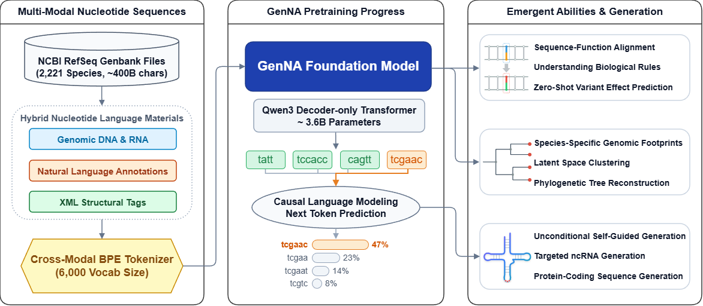
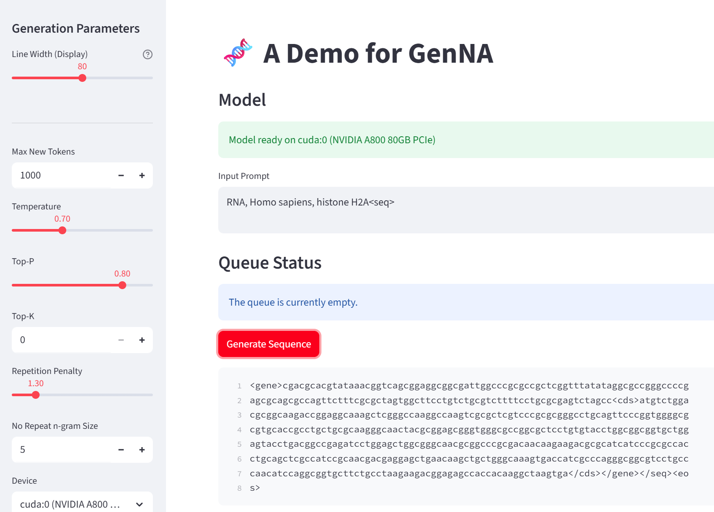

# GenNA: Conditional Generation of Nucleotide Sequences Guided by Natural-Language Annotations

## Introduction 📖

**GenNA** is a framework for conditional generation of nucleotide sequences guided by natural-language annotations.




## Environment Setup ⚙️

To run this project, we recommend creating a conda environment as follows:

```bash
conda create -n genna python=3.10
conda activate genna
pip install -r requirements.txt
```

---

## Pretraining Dataset 📂

Download the **GenBank full files** of your target species from the NCBI RefSeq database:

```text
https://ftp.ncbi.nlm.nih.gov/genomes/refseq/
```

For example, for **Homo sapiens**, the required files are:

* **Genomic DNA**:

  ```text
  https://ftp.ncbi.nlm.nih.gov/genomes/refseq/vertebrate_mammalian/Homo_sapiens/reference/GCF_000001405.40_GRCh38.p14/GCF_000001405.40_GRCh38.p14_genomic.gbff.gz
  ```

* **RNA**:

  ```text
  https://ftp.ncbi.nlm.nih.gov/genomes/refseq/vertebrate_mammalian/Homo_sapiens/reference/GCF_000001405.40_GRCh38.p14/GCF_000001405.40_GRCh38.p14_rna.gbff.gz
  ```

### Data Preprocessing 🛠️

For **Genomic DNA** GenBank full files, run:

```bash
python scripts/genome_preprocess.py input.gbff.gz output.txt
```

For **RNA** GenBank full files, run:

```bash
python scripts/rna_preprocess.py input.gbff.gz output.txt
```

See `data/sample.txt` for an example of what the output file looks like.

You may also use your own GenBank full files to build a custom dataset.

---

## Model Weights 📦

Available pretrained model checkpoints:

* **3.6B**: `https://huggingface.co/DrBlack/GenNA`
* **0.36B**: `https://huggingface.co/DrBlack/GenNA-small`

After downloading, place the model weight folders into the `model/` directory.

---

## Pretraining 🚀

To reproduce our pretraining pipeline or train your own model, run:

```bash
python train.py configs/train_GenNA.json
```

or

```bash
python train.py configs/train_GenNA_small.json
```

Please replace the following field in the config JSON file:

```json
"train_file": "data/sample.txt"
```

with the actual path to your training dataset.

---

## Testing ✅

To test whether the model can generate sequences properly, use:

```text
test/test_generation.ipynb
```

If you have `streamlit` installed, you can also launch a web interface for generation testing:

```bash
streamlit run test/web.py
```



---

## Generation Experiments 🧪

The scripts for generation experiments and visualization in the GenNA manuscript are located in the `downstream/` directory.

For example, to evaluate **tRNA generation**, run:

```bash
python downstream/tRNA/generate.py
```

This will generate a file:

```text
outputs/tRNA.txt
```

Then convert it to FASTA format:

```bash
python downstream/tRNA/txt2fasta.py
```

Install **tRNAscan-SE** and run it:

```bash
conda install -c bioconda trnascan-se
tRNAscan-SE -E outputs/tRNA.fasta -o outputs/tRNAscan.txt
```

After that, fill in the path to the `tRNAscan-SE` output file in:

```text
downstream/tRNA/visualize.ipynb
```

and run the notebook to obtain the visualization results.
